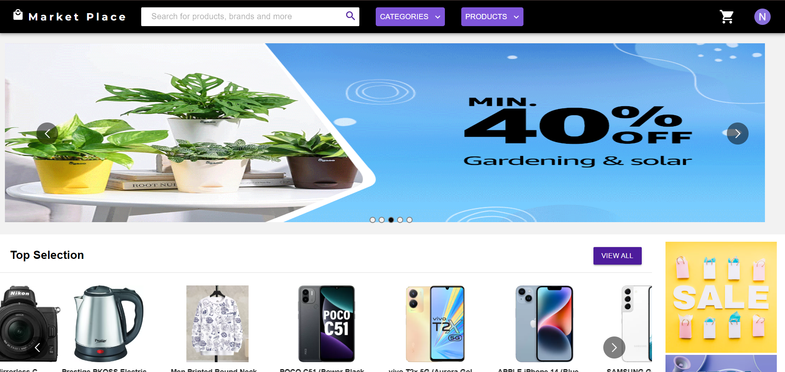
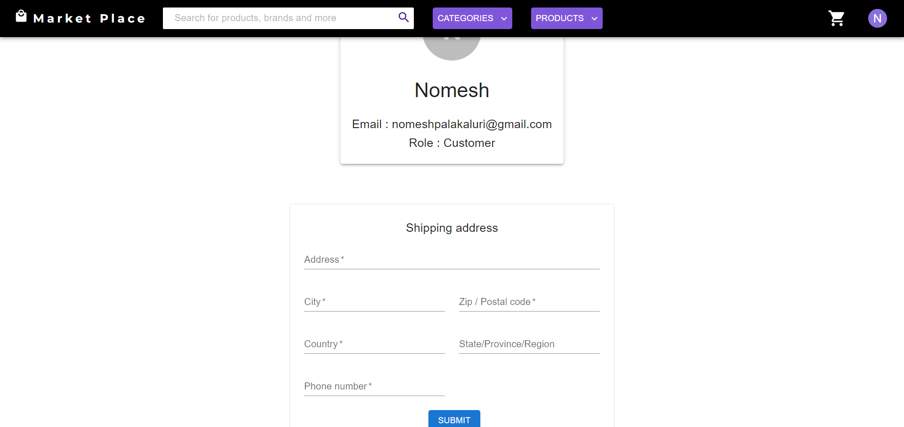

### Online Marketplace

**About:**
Online Marketplace is an eCommerce site developed using the MERN (MongoDB, Express.js, React, Node.js) stack. It offers a user-friendly and efficient shopping experience for customers while providing sellers with essential tools to manage their products and sales.

**Features:**
- **User Registration:** Allows users to register as customers or sellers for a tailored shopping experience.
- **Cart System:** Enables customers to add products to their cart, review, and manage selections before purchase.
- **Product Search:** Offers search functionality by name or category (e.g., Electronics, Clothes, Kitchen).
- **Reviews and Ratings:** Customers can leave reviews and ratings, providing valuable feedback for sellers.
- **Seller Dashboard:** Provides sellers with a dashboard to manage products, view sales data, and gain insights through data visualization.
- **Product Management:** Allows sellers to add products with detailed information and prices, and check which customers have added their products to their carts.
- **Order Tracking:** Sellers can monitor customer orders for organized and efficient fulfillment.

**Technologies Used:**
- **Frontend:** React.js, Material UI, Redux Toolkit, Styled Components
- **Backend:** Node.js, Express.js, JWT Token
- **Database:** MongoDB
- **Data Visualization:** React Apexcharts

**Installation:**

1. **Clone the Repository:**
   ```bash
   git clone https://github.com/Yogndrr/MERN-Ecommerce-Site.git
   ```
2. **Setup Backend (Terminal 1):**
   ```bash
   cd backend
   npm install
   npm start
   ```
   Create a `.env` file in the backend folder:
   ```env
   MONGO_URL=mongodb://127.0.0.1/ecommerce
   SECRET_KEY='secret-key'
   ```
   Replace `mongodb://127.0.0.1/ecommerce` with your database link.

3. **Setup Frontend (Terminal 2):**
   ```bash
   cd frontend
   npm install
   npm start
   ```
   Navigate to `localhost:3000` in your browser. The backend API will run at `localhost:5000`.

**Error Solution:**
If you encounter a network error while signing up:
1. Navigate to `src/redux/userHandle.js`.
2. Add after import statements:
   ```js
   const REACT_APP_BASE_URL = "http://localhost:5000";
   ```
3. Replace all instances of `process.env.REACT_APP_BASE_URL` with `REACT_APP_BASE_URL`.

These steps should resolve the network error. If issues persist, contact me for further assistance.

**Snapshots:**
Here are some snapshots of the Online Marketplace:
- **Home Page:** 
- **Product Page:** )
- **Profile Page:** 
- **Seller Dashboard:** )

Don't forget to leave a star for this project if you found the solution helpful. Thank you!
